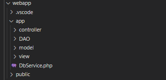

# DTM TOOLS  TEST

Lucas Neves Lima

## 1
### DB model
***a)*** 
.png)

***b)***

With the script installed on the machines, it is possible to use a web page developed with HTML, CSS, JS, and PHP to query and manipulate that data. In this repository, a sketch was made with some basic functionalities of a website to meet the requested requirements. The application was developed using the MVC (Model View Controller) model and the DAO (Data Access Object) pattern to access the data. The following image shows the structure of the repositories in the project.

Using PDO, it is possible to connect to a MySQL database and execute queries to return the data stored in the database. The frontend uses a CSS framework for the assembly of components.

***c)*** 

To maintain information of the machines, the use of a shell script installed on the monitored machines configured in the "crontab" (a service that runs on Linux for scheduling and programming the execution of commands) would be used to run periodically. The following information is necessary and the following commands will be used to return this information:

- Logged users:
~~~ 
$: who  
~~~
- CPU Usage:
~~~
$: top
~~~~
- Runing Processes:
~~~
$: psaux
~~~ 
- Memory Usage:
~~~
$: free
~~~ 

The script consists of getting the output of these commands, parsing them into variables and inserting them into the database designed following the model made in item a.
~~~ sh
#!/bin/bash
# Constants
machine_id = 001
log_date = $(date '+%Y-%m-%d %H:%M:%S')
mysql_host = host.address
user = machine_logger
user_password = ******

# Get system info
mem_usage=$(free -m | awk 'NR==2{printf "%.2f", $3*100/$2 }')
running_processes=$(ps aux | awk '{print "[" $2 "," $11 "," $1 "]"}')
logged_users=$(who | awk '{print $1}')
cpu_usage=$(top -b -n1 | grep "Cpu(s)" | awk '{print $3 + $4}')

# Update Machine info in DB
mysql -h $mysql_host -u $user -p $user_password -e "
  USE MACHINES_DATABASE;

  INSERT INTO log (machineId, logDate, memoryUsage, loggedUsers, runningPorcess, cpuUsage
  VALUES ('$machine_id', '$log_date', '$mem_usage','$logged_users',$running_processes','$cpu_usage');
  
  UPDATE machines
  SET lastUpdateDate = '$log_date'
  WHERE id = '$machine_id';
"
~~~~

---------
## 2

To proceed with an update on a critical system, it is necessary to have an update plan and in sequence I will list the steps that I would follow.

- Firstly, ensure that the new version with the package has been tested and validated.
- From this point, create a plan for a possible failure and ensure that there is a way to return the system to the pre-update package version.
- With a rollback method guaranteed, the next step is to study when the system will be less loaded and plan the update for that low-impact moment.
- After the update is made, there needs to be a period of testing and monitoring of the system to ensure that there were no problems resulting from the update
  
---------
## 3

A method that meets the specified requirements was implemented in Python, and the .py file with this logic can be found in the repository.
~~~~ python
def checkPasswd(x):
    match x[0]:
        case 'LEN':
            if checkLengh(passwd,x[1],x[2]): 
                return "LEN - PASS"
            else: 
                return "LEN - NOT PASS"
        case 'LETTERS':
            if checkLetters(passwd,x[1],x[2]):
                return "LETTERS - PASS"
            else: 
                return "LETTERS - NOT PASS"
        case 'NUMBERS':
            if checkNumbers(passwd,x[1],x[2]):
                return "NUMBERS - PASS"
            else: 
                return "NUMBERS - NOT PASS"
        case 'SPECIALS':
            if checkSpecials(passwd,x[1],x[2]):
                return "SPECIALS - PASS"
            else: 
                return "SPECIALS - NOT PASS"
~~~~

------
## 4

Firstly, it is necessary to have a good process for implementing new features and bug fixes within the team responsible for the project. With a well-aligned team and well-defined processes, it is possible to implement a deployment automation that includes unit tests, integration tests, and A/B tests (using systems like Canary), where it is possible to validate by sampling that an update was successful before fully deploying it to production.

Another important factor that can help is the use of versioning following semantic standards, and releasing versions associated with tags that represent those versions in GIT.